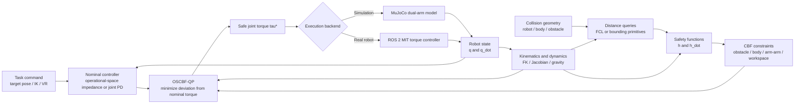
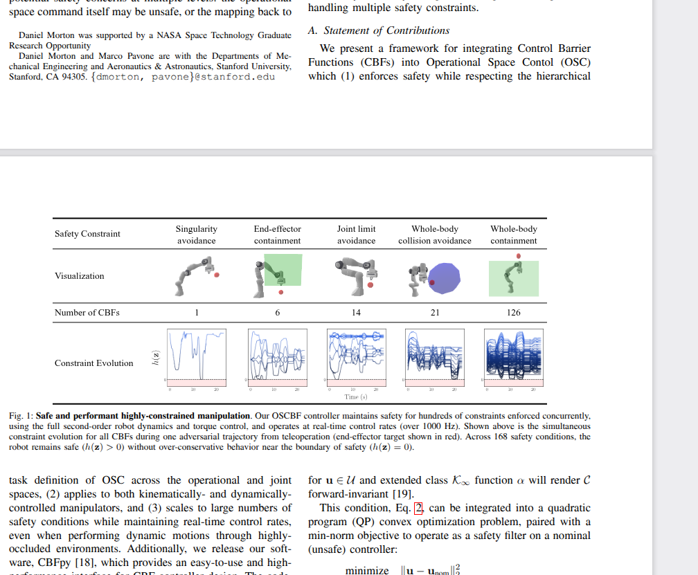
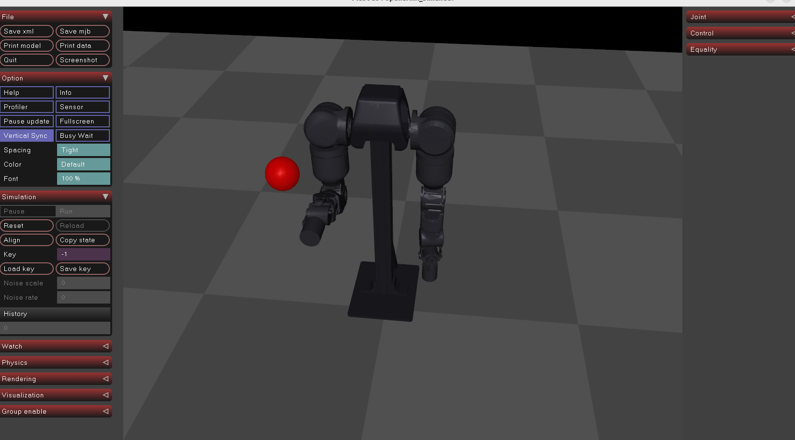
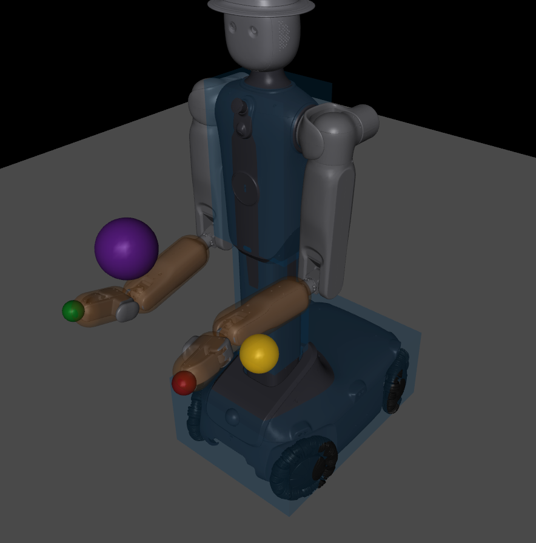
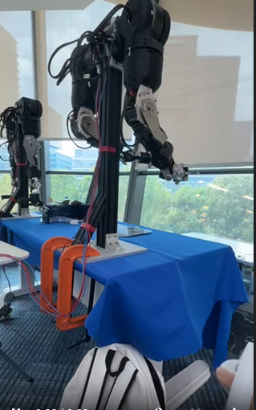
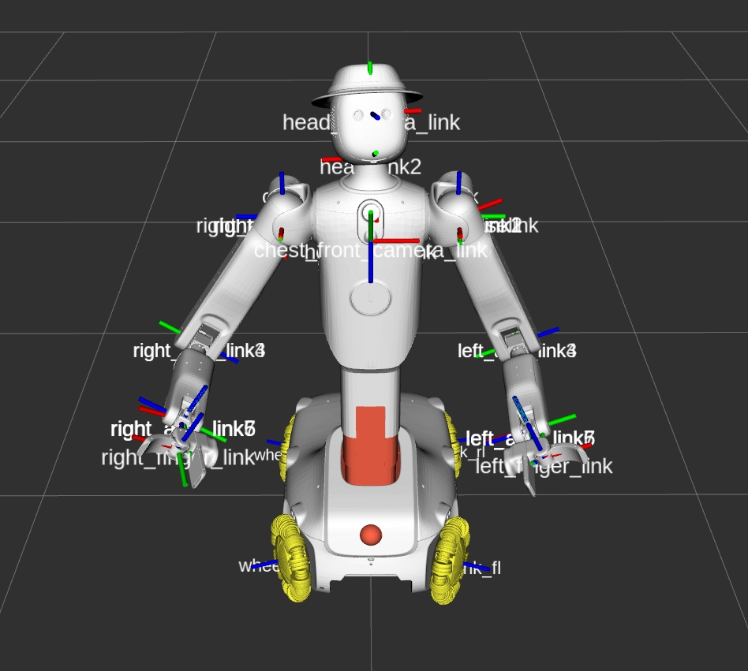

# OSCBF-openarmx

<p align="center">
  <a href="./README.md"></a>
  <a href="./README.zh-CN.md"></a>
</p>

An open-source reproduction of Operational-Space Control Barrier Functions (OSCBF) on the OpenArmX dual-arm platform. The project covers the simulation-to-real workflow and demonstrates robot-body collision avoidance, inter-arm collision avoidance, and extensions toward singularity and general obstacle avoidance.

## Highlights

- Torque-level operational-space control with CBF safety constraints
- Dual-arm MuJoCo simulation and OpenArmX robot deployment
- Robot-body, arm-arm, obstacle, and workspace-boundary constraints
- FCL-based collision-distance queries and Jacobian-based constraint construction
- VR end-effector teleoperation with OSCBF safety filtering
- Paired CBF / no-CBF examples for comparison

## System architecture



The nominal controller generates the torque required to track the requested motion. In parallel, robot state and collision geometry are converted into second-order CBF inequalities. The QP then finds the closest admissible torque, subject to collision, workspace, and actuator-limit constraints, before sending it to either MuJoCo or the real robot.

## Repository contents

| File | Purpose |
| --- | --- |
| `oscbf_openarmx_ee_cbf.py` | Dual-arm end-effector control with OSCBF constraints |
| `oscbf_openarmx_ee_no_cbf.py` | End-effector-control baseline without active CBF filtering |
| `oscbf_openarmx_double.py` | Dual-arm OSCBF simulation scenario |
| `oscbf_openarmx_no_cbf.py` | Dual-arm baseline used for comparison |
| `vr_oscbf_openarmx.py` | VR teleoperation with right-arm OSCBF protection |
| `oscbf_mit_controller.cpp` | Real-robot ROS 2 torque controller |
| `openarmx_mujoco.xml` | OpenArmX dual-arm MuJoCo model |
| `oscbf.pdf` | Reference OSCBF paper included in this repository |

## Quick start

The simulation code depends on MuJoCo, NumPy, SciPy, OSQP, Python-FCL, Robotics Toolbox for Python, SpatialMath, Transforms3D, and a MuJoCo viewer. Install versions compatible with your Python and system FCL installation, then run a scenario from the repository root:

```bash
python oscbf_openarmx_ee_cbf.py
```

Compare it with the corresponding unfiltered baseline:

```bash
python oscbf_openarmx_ee_no_cbf.py
```

The VR example additionally expects the `telegrip` configuration and WebSocket server referenced by `vr_oscbf_openarmx.py`. The real-robot controller must be integrated into the corresponding OpenArmX ROS 2 workspace before it can be built and launched.

## Results

### OSCBF paper



### OpenArmX simulation



### Qijia simulation



### OpenArmX real-robot validation



### Qijia RViz view



## License

See [LICENSE](./LICENSE).
