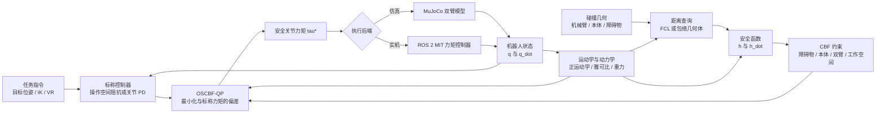

# OSCBF-openarmx

<p align="center">
  <a href="./README.md"></a>
  <a href="./README.zh-CN.md"></a>
</p>

本项目基于 OpenArmX 双臂平台，使用开源硬件复现操作空间控制屏障函数（OSCBF），打通从仿真到实机的完整流程。项目实现了机械臂与本体避碰、双臂互碰避免，并可进一步扩展到奇异点避免和通用障碍物避碰场景。

## 项目亮点

- 基于力矩控制的操作空间控制与 CBF 安全约束
- OpenArmX 双臂 MuJoCo 仿真及实机部署
- 支持机械臂与本体、双臂之间、外部障碍物及工作空间边界约束
- 使用 FCL 计算碰撞距离，并结合雅可比构造安全约束
- 支持带 OSCBF 安全过滤的 VR 末端遥操作
- 提供 CBF 与无 CBF 的对照示例

## 系统架构



标称控制器首先根据目标运动生成跟踪力矩；与此同时，系统根据机器人状态和碰撞几何构造二阶 CBF 不等式。QP 在碰撞、工作空间和执行器力矩限制下，求出与标称力矩最接近的安全力矩，并将其发送到 MuJoCo 或真实机器人。

## 文件说明

| 文件 | 用途 |
| --- | --- |
| `oscbf_openarmx_ee_cbf.py` | 带 OSCBF 约束的双臂末端控制 |
| `oscbf_openarmx_ee_no_cbf.py` | 未启用 CBF 过滤的末端控制基线 |
| `oscbf_openarmx_double.py` | 双臂 OSCBF 仿真场景 |
| `oscbf_openarmx_no_cbf.py` | 用于效果对照的双臂基线 |
| `vr_oscbf_openarmx.py` | 带右臂 OSCBF 保护的 VR 遥操作 |
| `oscbf_mit_controller.cpp` | 实机 ROS 2 力矩控制器 |
| `openarmx_mujoco.xml` | OpenArmX 双臂 MuJoCo 模型 |
| `oscbf.pdf` | 仓库内附的 OSCBF 参考论文 |

## 快速开始

仿真代码依赖 MuJoCo、NumPy、SciPy、OSQP、Python-FCL、Robotics Toolbox for Python、SpatialMath、Transforms3D 和 MuJoCo viewer。请根据当前 Python 环境及系统 FCL 版本安装兼容的依赖，然后在仓库根目录运行：

```bash
python oscbf_openarmx_ee_cbf.py
```

可运行对应的无安全过滤版本进行对比：

```bash
python oscbf_openarmx_ee_no_cbf.py
```

VR 示例还需要 `vr_oscbf_openarmx.py` 中引用的 `telegrip` 配置和 WebSocket 服务。实机控制器需要先集成到对应的 OpenArmX ROS 2 工作空间中，再进行编译和启动。

## 效果展示

### OSCBF 论文


### OpenArmX 仿真验证


### Qijia 仿真验证


### OpenArmX 实机验证


### Qijia RViz 视图


## 开源协议

详见 [LICENSE](./LICENSE)。
